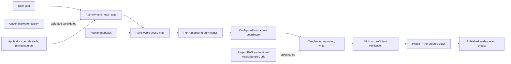

# iOS-experts

**Version:** 2.0.0-beta.8

Agent-neutral skills and a guarded task-to-PR harness for iOS, iPadOS, watchOS, and macOS. It supports Codex,
Claude Code, or one-writer collaboration without duplicating Apple-authored Xcode skills.

## How to Install

### 1. Install the skills

Use the Agent Skills-compatible CLI to inspect or install the collection:

```sh
npx skills add ShawnBaek/iOS-experts --list
npx skills add ShawnBaek/iOS-experts
npx skills add ShawnBaek/iOS-experts -a codex -a claude-code
```

The commands list skills, install for the detected agent, or explicitly install for both clients. Use the last
option only when both clients participate.

### 2. Connect Codex or Claude to Xcode

The [`xcodebuild`](skills/xcodebuild/SKILL.md) skill prefers Xcode's official MCP bridge. Open the exact project
or workspace, then enable **Xcode > Settings > Intelligence > Model Context Protocol > Allow external agents to
use Xcode tools**. Register only the client you use:

```sh
codex mcp add xcode -- xcrun mcpbridge
claude mcp add --transport stdio xcode -- xcrun mcpbridge
```

Verify with `codex mcp list` or `claude mcp list`. For the first connection, keep Xcode open and accept its
connection/access prompt if shown. Settings changes may require permission again or a new agent task. See Apple's
[external-agent setup](https://developer.apple.com/documentation/xcode/giving-external-agents-access-to-xcode).

The health gate checks exact registration and one bounded read-only MCP response; the task then confirms exposure
to the exact Xcode window before use. It does not build for connectivity; third-party adapters are explicit fallbacks.

### 3. Add AppleSampleCode retrieval when needed

AppleSampleCode is optional independent analysis, not an Apple official MCP, and never overrides live Apple
documentation or pinned source. Register it only for the selected client:

```sh
codex mcp add apple-sample-code --url https://mcp.applesamplecode.com/mcp
claude mcp add --transport http apple-sample-code https://mcp.applesamplecode.com/mcp
```

The health check verifies exact read-only tools and corpus provenance. The
[MCP guide](https://applesamplecode.com/MCP.html) documents the endpoint; npm/Registry publication is unnecessary.

### 4. Enable the task-to-PR harness in an app repository

Installing a skill does not copy the root policy into an app. Keep `AGENTS.md` in the app, but materialize JSON templates with `scripts/materialize_private_template.py` so copied files retain a valid absolute installed-schema URI:

```text
templates/AGENTS.md              -> <app-repository>/AGENTS.md
templates/harness.json           -> <private-untracked-host-path>/harness.json
templates/private-policy-overlay.json -> <private-untracked-host-path>/policy.json
templates/run-authorization.json -> <private-untracked-run-root>/authorization.json
```

Keep the populated harness, contract-bundle hash, account/team IDs, run ledger, receipts, and live authorizations private and untracked. Configure one shared
Codex/Claude coordinator with the [step-by-step setup](skills/agent-harness/references/coordinator-setup.md), then start
health checks from `apple-development-health/templates/health-observations.json`.

### 5. Optional: add a private project registry

If one developer or host has several project checkouts, materialize
`agent-harness/templates/project-registry.local.example.json` to any private or ignored location and resolve it with
`agent-harness/scripts/resolve_project.py`. Explicit paths and the exact opened Xcode container remain authoritative;
multiple valid candidates require human selection. See the [registry contract](skills/agent-harness/references/project-registry.md).

## How to Use

- Start broad Apple-platform work with [`native-app-lead`](skills/native-app-lead/SKILL.md).
- Use [`agent-harness`](skills/agent-harness/SKILL.md) for approved work through an evidence-backed PR.
- Use [`delivery-report`](skills/delivery-report/SKILL.md) to preview or exactly authorize a private completion summary.
- Invoke a specialist directly for a narrow build, test, data, release, package, Git, evidence, or CI task.

Choose exactly one collaboration mode:

| Mode | Writer | Review |
| --- | --- | --- |
| Codex primary | Codex | optional frozen-patch review |
| Claude primary | Claude | optional frozen-patch review |
| Collaborative | one selected writer | the other reads and reviews the frozen patch |

A Local LLM may retrieve, rerank, extract entities, or cluster logs on loopback, but never writes or approves.
Human feedback updates affected plan/evidence; durable self-improvement remains a reviewed change.

Unless the user fixes a model, each graph node is classified `simple`, `standard`, or `deep`. Current examples are
Codex Luna/Terra/Sol and Claude `haiku`/`sonnet`/`opus`; the harness resolves current availability at run time,
keeps planning/high-risk review on deep capability, and escalates only from evidence.

## Architecture and Delivery



The harness separates authority, product truth, Apple API truth, and execution. Apple docs/Xcode lead for current
behavior; accepted specifications and repository source define the product. RAG supplies cited context only.
Every mutable resource acquire uses one explicitly configured host-shared coordinator; per-run ledgers and the
optional registry are evidence, not locks. Missing or stale receipts stop with `coordination_required`.

Split growing work into coherent phases. Each PR answers one reviewer question, owns bounded paths, leaves a valid
state, and has checks/evidence. Dependent phases form a documented stack. Stack approval never implies merge,
force-push, retarget, TestFlight, or App Review authority.

## Evidence and Testing

Run the smallest test set that proves changed behavior; add regression tests only for plausible recurrence.

- Use stable, nonlocalized `accessibilityIdentifier` values for automation; keep labels/values/traits accessible.
- Use screenshots for static states and trimmed recordings for motion. Prepare the state first; omit Home, icon
  taps, launch, splash, and waiting unless startup is the acceptance target.
- Preserve raw video, publish the reviewed trim, and verify playback, boundary frames, hashes, and viewer access.
- A build exit code is not runtime proof. Report platform, destination, `.xcresult`, state, and omitted coverage.
- Finish with provider-reported token usage per model/agent; mark partial or unavailable data instead of estimating.

## Skills

| Skill | Responsibility |
| --- | --- |
| [`agent-harness`](skills/agent-harness/SKILL.md) | bounded graph/loop task-to-PR delivery |
| [`native-app-lead`](skills/native-app-lead/SKILL.md) | broad Apple-platform routing |
| [`apple-development-health`](skills/apple-development-health/SKILL.md) | read-only CLI, MCP, account, and runtime readiness |
| [`xcode-project-workflow`](skills/xcode-project-workflow/SKILL.md) | authoritative Xcode root, container, and branch preflight |
| [`xcodebuild`](skills/xcodebuild/SKILL.md) | official-first build, test, run, debug, and capture |
| [`core-simulator-health`](skills/core-simulator-health/SKILL.md) | bounded non-reboot Simulator diagnosis and recovery |
| [`apple-platform-testing`](skills/apple-platform-testing/SKILL.md) | minimum-sufficient XCTest/XCUITest planning |
| [`screenshot`](skills/screenshot/SKILL.md) | deterministic screenshots and trimmed video evidence |
| [`delivery-report`](skills/delivery-report/SKILL.md) | private, authorized Telegram/WhatsApp/iMessage completion summaries |
| [`apple-platform-ui`](skills/apple-platform-ui/SKILL.md) | SwiftUI/UIKit implementation |
| [`xcode-preview-design`](skills/xcode-preview-design/SKILL.md) | Figma-optional code-first Preview and motion review |
| [`apple-platform-performance`](skills/apple-platform-performance/SKILL.md) | performance diagnosis and verification |
| [`apple-data`](skills/apple-data/SKILL.md) | Core Data, SwiftData, CloudKit, and web-service choice |
| [`core-data`](skills/core-data/SKILL.md) | Core Data architecture, migration, and concurrency |
| [`swift-package-manager`](skills/swift-package-manager/SKILL.md) | dependency resolution without cache churn |
| [`git-workflow`](skills/git-workflow/SKILL.md) | branches, optional worktrees, index recovery, and PR stacks |
| [`commit-message`](skills/commit-message/SKILL.md) | evidence-based commit messages |
| [`github-projects`](skills/github-projects/SKILL.md) | Issues and Projects v2 tracking |
| [`cicd`](skills/cicd/SKILL.md) | guarded GitHub Actions for Apple builds |
| [`app-versioning`](skills/app-versioning/SKILL.md) | marketing/build version source-of-truth changes |
| [`apple-ads`](skills/apple-ads/SKILL.md) | account-guarded Apple Ads campaigns, keywords, budgets, and optimization |
| [`app-store-connect`](skills/app-store-connect/SKILL.md) | upload, TestFlight, metadata, and submission gates |
| [`storekit-sandbox-testing`](skills/storekit-sandbox-testing/SKILL.md) | StoreKit local, sandbox, and TestFlight purchase verification |
| [`xcode-storage`](skills/xcode-storage/SKILL.md) | itemized Xcode/Simulator storage audit and cleanup |
| [`figma-bridge`](skills/figma-bridge/SKILL.md) | Figma-to-code and simulator parity routing |
| [`icon-composer`](skills/icon-composer/SKILL.md) | Apple icon authoring and IconGen provenance handoff |
| [`app-website`](skills/app-website/SKILL.md) | SwiftUI-For-Web app landing pages |

## Safety Gates

- Resolve the authoritative checkout, remote, open Xcode container, and toolchain before edits or Apple tools.
- Prepare an approved branch from the remote default; use a worktree only when explicitly requested.
- A worktree never creates parallel writer permission for the same logical repository.
- Confirm repository/path/branch/remote before the first commit or push.
- Use one writer; bind read-only review to a frozen patch identity.
- Keep Xcode/Simulator calls in the logged-in host environment, never a sandbox.
- Treat Git locks/refs, Simulator registry, and package failures separately; use scoped recovery.
- Never erase all simulators/caches, edit CoreSimulator registry, switch accounts, or expose credentials.
- Publish only authorized paths; verify remote SHA, PR base/head, checks, and evidence per phase.

## Repository Validation

This documentation/contract repository does not require an Xcode build:

```sh
python3 scripts/validate_repository.py
python3 -m unittest discover -s tests -p 'test_*.py'
npx skills add ./ --list
```

Also validate each changed skill. Documentation-only work does not justify a four-platform build matrix.

## References

Official Apple: [external Xcode agents](https://developer.apple.com/documentation/xcode/giving-external-agents-access-to-xcode), [agent customization](https://developer.apple.com/documentation/xcode/extending-and-customizing-agents), [Xcode Previews](https://developer.apple.com/documentation/xcode/previewing-your-apps-interface-in-xcode), [HIG](https://developer.apple.com/design/human-interface-guidelines/), [HIG Motion](https://developer.apple.com/design/human-interface-guidelines/motion), [XCTest](https://developer.apple.com/documentation/xctest), [`accessibilityIdentifier`](https://developer.apple.com/documentation/uikit/uiaccessibilityidentification/accessibilityidentifier), [`XCUIElement.identifier`](https://developer.apple.com/documentation/xcuiautomation/xcuielementattributes/identifier).

Official agent/workflow docs: [OpenAI MCP](https://developers.openai.com/codex/mcp/), [OpenAI models](https://developers.openai.com/api/docs/guides/latest-model), [Codex platform](https://developers.openai.com/blog/codex-as-a-platform), [Claude models](https://code.claude.com/docs/en/model-config), [Claude usage](https://code.claude.com/docs/en/costs), [Claude MCP](https://code.claude.com/docs/en/mcp), [Anthropic knowledge graphs](https://platform.claude.com/cookbook/capabilities-knowledge-graph-guide), [Spec Kit v1.0.1](https://github.com/github/spec-kit/releases/tag/v1.0.1), [GitHub Projects](https://docs.github.com/en/issues/planning-and-tracking-with-projects).

Messaging setup: [Telegram Bot API](https://core.telegram.org/bots/api), [WhatsApp Cloud API](https://developers.facebook.com/documentation/business-messaging/whatsapp/get-started), [Apple Shortcuts CLI](https://support.apple.com/guide/shortcuts-mac/apd455c82f02/mac).

Independent: [AppleSampleCode MCP](https://applesamplecode.com/MCP.html), [IconGen](https://github.com/ShawnBaek/IconGen), [Agent Skills specification](https://agentskills.io/specification).
