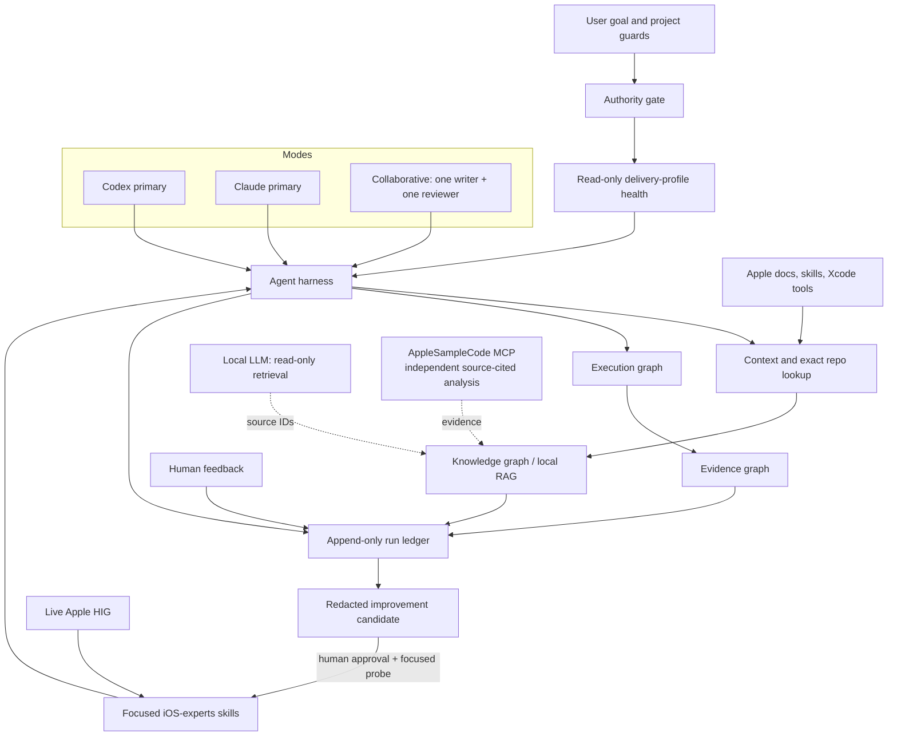
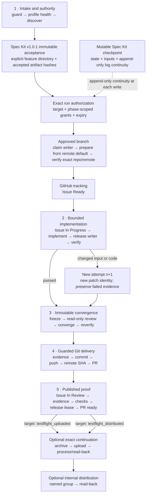
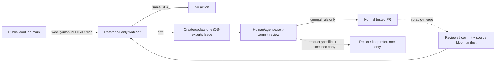

# iOS-experts

**Version:** 2.0.0-beta.3

Agent-neutral skills and a guarded task-to-pull-request harness for iOS, iPadOS,
watchOS, and macOS development.

The collection works with Codex, Claude Code, and other Agent Skills-compatible
tools. Version 2 adds graph/loop execution, evidence, local project RAG,
Apple-official-first routing, minimum-sufficient testing, safer Git/Xcode
operations, and GitHub Issues/Projects integration without copying Apple's own
Xcode skill bodies.

> Xcode 27 is still evolving. Resolve the current Xcode build, SDK, Apple skills,
> release notes, Simulator availability, and App Store requirements at run time.
> A beta-specific workaround belongs to evidence for that build, not permanent
> policy.

## What changed in 2.0

- An installable [agent harness](skills/agent-harness/SKILL.md), not merely a
  root instruction file.
- Codex-primary, Claude-primary, and Codex-plus-Claude collaboration with one
  repository writer at a time.
- One append-only run ledger that yields execution, knowledge, and evidence
  graph views.
- Bounded repair/review loops with explicit stop reasons and resumable evidence.
- Local LLMs limited to RAG, reranking, entity extraction, and log clustering.
- Apple Documentation Search, Apple-authored skills, and Xcode tools before
  repository or third-party substitutes.
- Focused SPM, XCTest/XCUITest, Git/worktree/index, version, storage, data, and
  GitHub Projects skills.
- PR-ready delivery with risk-derived checks and verified screenshots/videos or
  artifact links; merge and App Store submission remain separate gates.
- Spec Kit `v1.0.1` artifact/run-log binding, one-shot bounded run
  authorization, GitHub Issue lifecycle nodes, and optional TestFlight upload or
  exact internal-group continuation.
- A read-only Apple development health skill that distinguishes CLI/MCP install,
  registration, current-task exposure, capability connectivity, runtime health,
  app verification, and external-delivery readiness.
- A public, reference-only IconGen provenance watcher that opens or refreshes a
  review Issue without copying, executing, auto-applying, or auto-merging
  upstream content.
- Live AppleSampleCode MCP retrieval for source-cited sample analysis, with
  exact corpus provenance, Codex/Claude setup, and an approved snapshot fallback.

## Architecture



The harness keeps three precedence questions separate:

| Question | Order |
|---|---|
| Who has authority? | system/current user → hard account/repository guards → accepted spec/decisions → repo defaults |
| What defines product behavior? | accepted spec/decisions → repository source at frozen HEAD → pinned dependency source → approved project analysis |
| What defines Apple API truth? | live Apple docs for selected toolchain → one Apple-authored skill exposure → pinned Apple sample → iOS-experts → external sources |
| What executes the task? | Xcode official tools → Apple's external-agent bridge → host Apple CLI → explicit third-party fallback |

Apple built-in and Apple-exported skills are alternative exposure paths. When
one owns the exact task, use it and record its provider/version; do not load a
duplicate repository specialist.

For Xcode MCP, the harness proves five states separately: executable provenance,
client registration, exposure in the current task, one bounded read-only
capability response, and binding to the exact Xcode workspace session. A Homebrew tap, global npm package,
`npx @latest` process, or enabled config entry proves only its own layer. Codex
uses Apple's `xcrun mcpbridge` route first; third-party providers remain pinned,
explicit fallbacks and are not run beside it against the same Simulator incident.

## Bounded task-to-PR flow



The execution graph stays acyclic. A retry creates a new attempt linked to the
old one, preserving the failed evidence. Default bounds are three implementation
attempts, two review cycles, one transient retry, and stop after the same
normalized failure appears twice. Reaching a cap is never success.

Mid-run human feedback is appended to the ledger and linked to what it changes;
affected plans, reviews, and evidence are invalidated rather than silently
rewritten. A correction applies to the current run immediately within its
authority. Durable self-improvement is a separate redacted proposal with a
focused before/after probe, explicit approval or repeated evidence, normal PR
review, and a rollback reference. Local LLMs may cluster feedback but cannot
approve or apply policy.

Resource leases are scoped: repository writer, Xcode project mutation, build
tuple, Simulator/device, host CoreSimulator runtime registry, signing/App Store
Connect, and GitHub external writes. This permits safe read-only parallelism
without pretending one global lock can protect every Apple resource.

The health gate never repairs the machine. It reports `healthy`, `degraded`,
`blocked`, or `not_applicable` per component. Installed, registered, exposed in
the current task, responsive for one bounded read-only capability, and bound to
the exact Xcode workspace are distinct MCP facts. GitHub Project scope, Local
LLM, Simulator, Icon Composer, or TestFlight support is optional unless the
selected delivery profile needs it.

On a Mac running several Xcode projects, every run is namespaced by repository,
container, build/cache tuple, bundle ID, tool session, and exact destination
UDID. Concurrent projects never share a mutable Simulator or UI session through
a device name or `booted`; a paired watch/iPhone is one lease. Service-wide
Simulator recovery waits until all active project leases are inventoried and
quiesced, then uses one host-wide runtime-registry lease and requires explicit
approval. Because that registry can be shared across stable and beta Xcode
installs, its key is the host scope rather than the selected Xcode build.

## Three collaboration cases

| Case | Writer | Review | Local LLM |
|---|---|---|---|
| Codex primary | Codex | optional read-only review | retrieval only |
| Claude primary | Claude | optional read-only review | retrieval only |
| Collaborative | one of Codex/Claude | the other reviews a frozen patch identity | retrieval only |

A collaborative review is bound to `patch_identity_v1 + exact paths + review diff`.
The selected writer is fixed by the user or accepted plan before the claim; the
reviewer has no mutation tools, and a stale diff is rejected. Writer transfer
requires capability revocation, release, a fresh capability snapshot, and a
matching repository state hash. The local model is never a fourth owner,
approver, writer, or reviewer of record.

## RAG and knowledge graph

Project RAG is useful for source, specs, accepted decisions, issue/PR history,
and selected AppleSampleCode.com analysis. Exact path/commit lookup comes before
embeddings. Every retrieved chunk carries source ID, authority tier, path/URL,
commit or Xcode build, timestamp, line span where applicable, and content hash.

Do not mirror the Apple documentation corpus. Query Xcode Documentation Search
for current API truth and preserve provenance. For AppleSampleCode.com analysis,
prefer the read-only `apple-sample-code` MCP at
`https://mcp.applesamplecode.com/mcp`; keep its server version, exact corpus
revision, tool/input, stable sample IDs, source-map citations, retrieval time,
and result hash. The service is independent analysis, not normative Apple
documentation, so tie implementation constraints back to an official document
or commit-pinned Apple sample. Store only selected results in local RAG rather
than mirroring or double-indexing its corpus.

Policy/account/lease documents are immutable input, never vector-retrieved
overrides. Retrieved text is untrusted data: embedded instructions cause zero
tool calls. Local embedding servers stay loopback-only and receive no Apple or
GitHub credentials.

## Skill catalog

### Coordination and project delivery

| Skill | Owns |
|---|---|
| [native-app-lead](skills/native-app-lead/SKILL.md) | routes broad Apple work to the smallest specialist set |
| [agent-harness](skills/agent-harness/SKILL.md) | graph/loop/RAG, three model modes, leases, evidence, task-to-PR |
| [apple-development-health](skills/apple-development-health/SKILL.md) | read-only CLI/skill/MCP/GitHub/Spec Kit/Xcode/Simulator/ASC readiness by delivery profile |
| [xcode-project-workflow](skills/xcode-project-workflow/SKILL.md) | authoritative Xcode root/container, host execution, XcodeGen gate |
| [git-workflow](skills/git-workflow/SKILL.md) | branch approval/naming, explicit worktrees, index-lock/AD recovery, PR Git state |
| [github-projects](skills/github-projects/SKILL.md) | Issues and Projects v2 planning/status linkage |
| [commit-message](skills/commit-message/SKILL.md) | staged-diff commit message only |

### Build, packages, testing, and operations

| Skill | Owns |
|---|---|
| [swift-package-manager](skills/swift-package-manager/SKILL.md) | manifest/lockfile, resolve/update/build separation, cache/failure layers |
| [apple-platform-testing](skills/apple-platform-testing/SKILL.md) | minimum-sufficient Swift Testing, XCTest/XCUITest, xcresult evidence |
| [xcodebuild](skills/xcodebuild/SKILL.md) | official-tools-first build/run/debug/Simulator and runtime-registry recovery |
| [apple-platform-performance](skills/apple-platform-performance/SKILL.md) | hangs, hitches, launch, view/body and media performance |
| [cicd](skills/cicd/SKILL.md) | least-privilege GitHub Actions and runner evidence |
| [xcode-storage](skills/xcode-storage/SKILL.md) | read-only disk audit and itemized, approved cleanup |
| [app-versioning](skills/app-versioning/SKILL.md) | marketing/build version source of truth and bundle verification |

### Product, UI, data, and release

| Skill | Owns |
|---|---|
| [apple-platform-ui](skills/apple-platform-ui/SKILL.md) | SwiftUI/UIKit UI with live Apple HIG and Apple-authored source policy |
| [figma-bridge](skills/figma-bridge/SKILL.md) | Figma-to-Apple UI handoff |
| [apple-data](skills/apple-data/SKILL.md) | Core Data/SwiftData/CloudKit/CloudKit Web Services routing |
| [core-data](skills/core-data/SKILL.md) | Core Data models, migration, concurrency, CloudKit mirroring |
| [icon-composer](skills/icon-composer/SKILL.md) | Apple icon design/Xcode handoff plus reference-only IconGen provenance |
| [screenshot](skills/screenshot/SKILL.md) | deterministic visual/video and App Store evidence |
| [app-store-connect](skills/app-store-connect/SKILL.md) | guarded TestFlight/App Store/Xcode Cloud operations |
| [app-website](skills/app-website/SKILL.md) | one-page app introduction site |

## Minimum-sufficient verification

Tests protect observable contracts and material safety boundaries, not a blanket
coverage number.

| Change | Default evidence |
|---|---|
| docs/format | schema, skill, and relative-link validation |
| routing/metadata | one positive and nearest-collision negative route |
| graph/schema | valid, malformed, and terminal-state contract |
| bug | one regression reproducing the original failure |
| logic | changed paths and material boundary/failure |
| UI | affected build, critical flow, relevant visual evidence |
| interaction/motion | affected flow plus video/UI recording |
| migration | representative old-to-new store and clean install |

Do not test the same contract at every layer or build a test framework larger
than the change without risk justification. Each new test names its observable
contract, prevented failure, and unique path. The PR states omitted checks and
residual risk. Full suites/matrices are for shared core, release, explicit user
requests, or impact graphs that justify them.

## Spec Kit, GitHub tracking, and delivery targets

Spec Kit remains the human-readable specification/workflow layer; the harness
owns authority, leases, attempts, evidence, and external writes. The adapter
pins `v1.0.1`, binds the explicit `feature_directory` plus the separately
approved Git branch, and hashes only accepted feature artifacts. Mutable run
state and append-only logs use a separate checkpoint. One feature Issue is
the default; `T###` child Issues are created only for independently reviewable PR-sized
work.

An immutable authorization can remove routine green-path prompts after the
repository, accepted feature/branch mapping, scope, derived-artifact policy,
actions, and target rules are exact. It never
authorizes force push, merge/auto-merge, ruleset/scope expansion, signing
mutation, destructive cleanup, App Review, or production release. The three
targets are `pr_ready`, `testflight_uploaded`, and
`testflight_distributed` (named internal groups only).



IconGen is public, but currently has no declared license. The watcher needs only
the current repository `GITHUB_TOKEN` with `contents: read` and `issues: write`;
it never writes to IconGen, runs its generators, copies files, opens a PR, or
merges. Updating the reviewed revision remains an ordinary evidence-backed PR.

## Git sandbox and linked-worktree recovery

The [git-workflow guide](skills/git-workflow/SKILL.md) treats working-tree,
index, local branch, and remote state separately. If a linked worktree's resolved
Git metadata is outside the sandbox, a permission failure creating its resolved
`index.lock` is an environment boundary, not a stale lock.

For the general `AD` state—Added in the index and Deleted in the worktree—the
agent generates a path-safe host Terminal command using the exact path reported
by Git:

```sh
git restore --staged -- '<exact-path-from-status>'
```

It then verifies index, worktree, local tracking, and remote SHA independently.
It does not retry in the sandbox, delete `index.lock`, chmod/chown Git metadata,
create an alternate index, or clone/move the repository.

## PR evidence

A PR body contains the acceptance mapping, checks/results, platform/toolchain,
evidence hashes/links, omitted checks, and known limitations.

If Simulator installation or launch stops responding after a successful build,
the runtime guide preserves that build, cancels only the stuck operation, splits
boot/install/launch/UI inspection, and allows one bounded same-runtime control
device. Two destinations—or even read-only Xcode/Simulator queries—hanging turns
the runtime portion into an infrastructure blocker; it does not trigger repeated
builds, device erasure, DerivedData deletion, or a false UI-verification claim.

A repeated `unable to get a dev_t for store <store-id>` before destination
selection, a live-but-stalled `simdiskimaged`, or a timed pause while mixed-build
Cryptex/runtime images are enumerated is a separate runtime-disk registry
hypothesis. The harness stops query fan-out, maps the exact store/runtime/build,
and treats process continuity, runtime count, and mixed builds only as supporting
evidence. Runtime removal is itemized and approved through Xcode Components;
agents never delete registry/Cryptex/mount state directly.

A reboot clears stuck process state but not installed runtime registration or
multi-provider fan-out, so recovery resumes with one official-first Simulator
provider and one bounded inventory. The host registry lease is released before
the exact control-UDID lease is acquired; the two never overlap. Low free space
is recorded as separate pressure evidence, not declared the sole cause. The
default control check is one install/launch/screenshot pass; three identical
consecutive passes are required only when intermittent stability is itself an
acceptance criterion. A later
stable-versus-beta comparison changes one toolchain at a time and records any
runtime-version confounder before raising a regression hypothesis.

- Small permanent UI images may be committed only when repository policy allows.
- Human-facing screenshots/videos can use GitHub's documented browser attachment.
- `.xcresult`, videos, and large logs can use Actions artifacts with digest,
  retention, and expiry shown.
- `gh pr create` has no documented arbitrary local-file attachment option.
- Artifact existence is not acceptance; preview/playback and viewer access are
  verified after publication.
- Merge and App Store submission are never implied by PR creation.

## Install

Browse or install through the Agent Skills-compatible `skills` CLI:

```sh
npx skills add ShawnBaek/iOS-experts --list
npx skills add ShawnBaek/iOS-experts
npx skills add ShawnBaek/iOS-experts -a codex -a claude-code
```

Installing a skill copies its folder; it does not automatically install this
repository's root `AGENTS.md` into an app project. To enable the downstream
harness, install the full collection so its routed specialists are present,
then copy and customize these files from the installed `agent-harness` folder:

```text
templates/AGENTS.md   -> <app-repository>/AGENTS.md
templates/harness.json -> <app-repository>/.iosx/harness.json
templates/run-authorization.json -> <private-untracked-run-path>/authorization.json
```

Keep account/team identifiers in a private, untracked overlay referenced by the
project harness. Start a health report from
`apple-development-health/templates/health-observations.json`; store sanitized
evidence with the run, not credentials. Do not commit personal policy or live
authorization envelopes into this public collection.

## Repository contracts

Machine-readable capability, workflow, and ledger schemas live under
[agent-harness/contracts](skills/agent-harness/contracts/). The root
`AGENTS.md` and `CLAUDE.md` govern maintenance of this repository; the
installable template governs downstream projects.

Validate this documentation repository without running Xcode:

```sh
python3 scripts/validate_repository.py
python3 -m unittest discover -s tests -p 'test_*.py'
```

For each changed skill, also run the Agent Skills validator and list/install
smoke test available in your environment. A docs-only change does not justify an
Xcode build or four-platform matrix.

## Contributing

1. Work from the authoritative clean checkout and remote default branch.
2. Propose and obtain approval for a concise feature branch before editing.
3. Preserve existing skill IDs; a new skill needs a distinct trigger and owner.
4. Keep Apple-authored skill content external and use live official references.
5. Update the catalog, contracts, version, and Mermaid source together.
6. Run the minimum validators above.
7. Honor the active repository-confirmation gate before the first commit/push.
8. Open an evidence-backed PR; do not auto-merge.

Primary references:

- [Apple Human Interface Guidelines](https://developer.apple.com/design/human-interface-guidelines/)
- [Apple: Extending and customizing agents](https://developer.apple.com/documentation/xcode/extending-and-customizing-agents)
- [Apple: Giving external agents access to Xcode](https://developer.apple.com/documentation/xcode/giving-external-agents-access-to-xcode)
- [OpenAI: Codex as a platform](https://developers.openai.com/blog/codex-as-a-platform)
- [GitHub Spec Kit v1.0.1](https://github.com/github/spec-kit/releases/tag/v1.0.1)
- [Anthropic: Knowledge graph guide](https://platform.claude.com/cookbook/capabilities-knowledge-graph-guide)
- [AppleSampleCode MCP guide](https://applesamplecode.com/MCP.html)
- [GitHub Projects](https://docs.github.com/en/issues/planning-and-tracking-with-projects)
- [IconGen companion upstream](https://github.com/ShawnBaek/IconGen)
- [Agent Skills specification](https://agentskills.io/specification)
