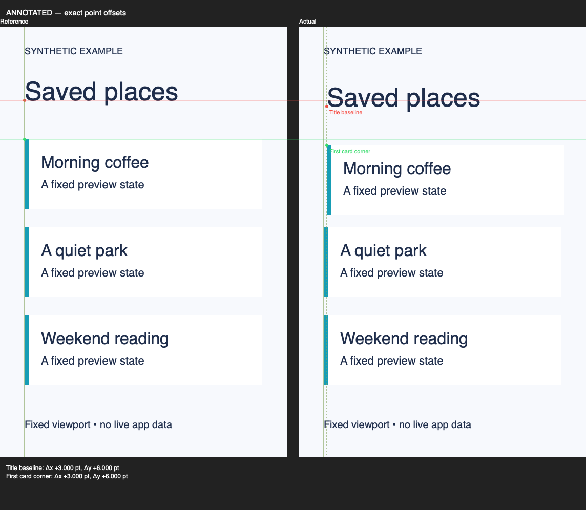

# Comparison example

These images are **synthetic fixtures**, generated in Swift. They demonstrate the comparison tool; they are not Figma exports, Simulator captures, or proof that an app matches a design.

The title and first card intentionally move **3 pt right and 6 pt down**. Horizontal reference lines cross both panels. Vertical lines repeat the reference x position in each panel; dashed lines show the actual x position. The clean image retains the supplied pixels without guides.

- [Clean comparison](comparison/comparison-clean.png)
- [Measured deltas and input hashes](comparison/comparison-report.json)
- [Manifest](comparison-manifest.json) and [Swift fixture generator](generate-comparison.swift)

To reproduce in a new output directory, run the generator there, copy the manifest alongside its two PNGs, and run `apple-verify compare --manifest <directory>/comparison-manifest.json --output-dir <new-output-directory>`. The output directory must not already exist. Relative input paths in the report are resolved relative to the manifest.

The automated comparison test checks asymmetric image orientation, different input pixel scales, signed point deltas, canvas transforms, input preservation, incompatible aspect ratios and output collisions. Human inspection checks that the displayed guides and labels make sense. Animation and app performance need separate evidence.
