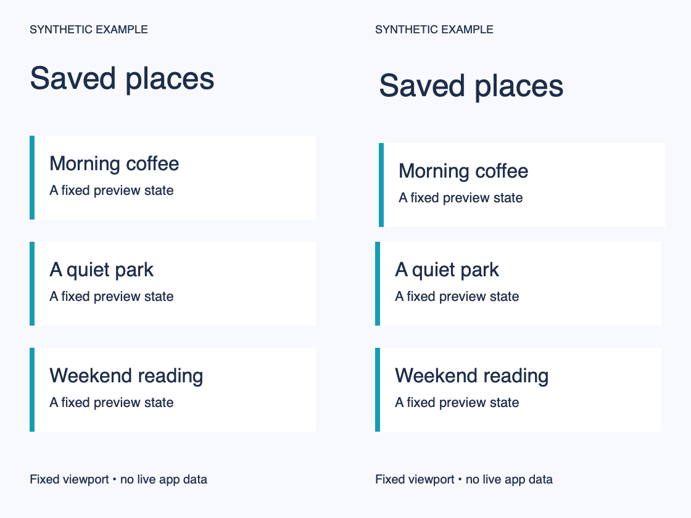
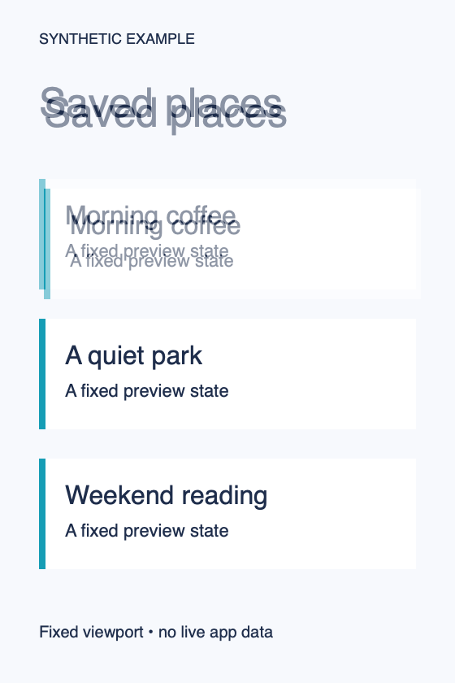
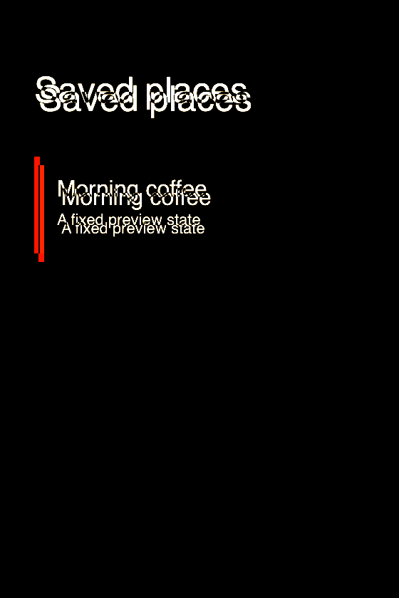
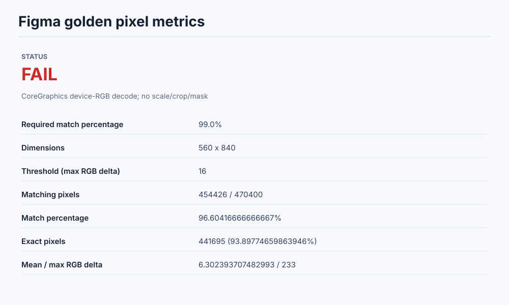
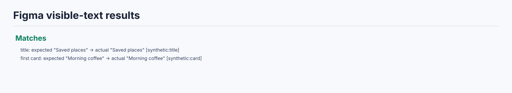

# Synthetic golden comparison

These are generated shapes and strings, not Figma exports or app captures.
The [Swift generator](../../generate-comparison.swift) creates a reference and
an actual input with the title/first card shifted 3 points right and 6 down.
The raw synthetic inputs are [reference](../../reference.png) and
[actual](../../actual.png). Both sides contain the same fixed strings.







Executed result: **Pixel comparison failed**, 454426 / 470400 pixels matching
(96.6041667%) at max RGB delta 16; required match 99%. Exit code 2 retained all
artifacts. This intentional failure proves reporting of geometry differences,
not a defect in a consumer app. JSON: [metrics](metrics.json),
[text observations](text-results.json). Text values come from the synthetic
generator, not OCR or a runtime hierarchy query.

From the collection checkout on macOS, using a new private output directory:

```sh
PROOF='<new-absolute-output-directory>'
mkdir -p "$PROOF"
swift docs/evidence/generate-comparison.swift "$PROOF"
FIGMA_GOLDEN_ROOT="$PWD/skills/figma-golden-testing"
swift "$FIGMA_GOLDEN_ROOT/scripts/overlay_diff.swift" \
  --figma "$PROOF/reference.png" --actual "$PROOF/actual.png" \
  --out "$PROOF/comparison" --threshold 16 --minimum-match 99
# Expected exit 2: continue to render the retained failure, not a success claim.
swift "$FIGMA_GOLDEN_ROOT/scripts/render_report.swift" \
  --metrics "$PROOF/comparison/metrics.json" \
  --text docs/evidence/figma-golden/synthetic/text-results.json \
  --out "$PROOF/comparison"
```

Font rasterization may vary across macOS versions; re-run and report observed
values rather than copying this score. The Swift CLI regression also checks
identical one-pixel fixtures (100% pass), deliberately different pixels (fail),
report-only mode, invalid arguments and malformed evidence.
