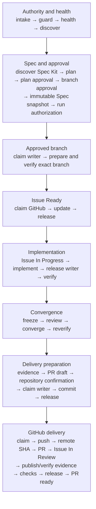

# Harness, graph, and loop architecture

## One ledger, three graph views

Persist an append-only typed run ledger. Derive these views instead of running
three databases in the first version:

- execution: `requires`, `blocks`, `fans_out`, `attempt_of`, `supersedes`;
- evidence: `produced_by`, `validates`, `invalidates`;
- knowledge: `derived_from`, `authoritative_for`, `superseded_by`.

The execution graph is acyclic. A repair creates a new attempt node linked with
`attempt_of` and `supersedes`, preserving the failed evidence.

Human corrections are append-only `feedback` records linked with `feedback_on`.
They invalidate affected plans, reviews, or evidence and may create a new
attempt; they never rewrite the earlier record. Durable improvement candidates
use `promoted_to` and remain separate reviewed changes.

This project layer does not replace an agent runtime. In Codex-primary mode,
reuse Codex's existing session/context, tool, sandbox, approval, and progress
surfaces; in Claude-primary mode, reuse Claude's corresponding runtime. The
provider-neutral contracts add project authority, graph state, cross-model
handoff, and evidence rather than implementing another shell or approval engine.

Node states are `pending`, `ready`, `leased`, `acting`, `verifying`, `passed`,
`failed_retryable`, `failed_terminal`, `awaiting_approval`, `blocked`, `skipped`,
or `superseded`. Do not use an unqualified `done` state.

## Default task graph

The exact 41-node control spine is:

`intake → guard → health → discover → discover_spec_kit → plan → approve_plan
→ branch_approval → bind_spec_kit_snapshot → bind_run_authorization →
claim_implementation_writer → prepare_and_verify_branch →
claim_github_tracking → ensure_issue_ready → release_github_tracking →
claim_github_in_progress → mark_issue_in_progress →
release_github_in_progress → implement → release_implementation_writer →
verify → freeze_review → review → converge → reverify → prepare_evidence →
prepare_pr → repository_confirmation → claim_delivery_writer → commit →
release_delivery_writer → claim_github_mutation → push → verify_remote_sha →
create_pr → mark_issue_in_review → publish_evidence →
verify_published_evidence → checks → release_github_mutation → pr_ready`.

`converge` is a decision node, not a hidden edit step. An accepted finding
creates a new implementation attempt and supersedes the old downstream nodes.
`reverify` therefore runs only after the current patch has converged and rejects
stale build, test, review, or evidence hashes.

Read-only research may fan out over a frozen snapshot. Repository writes,
Xcode project mutation, builds sharing a tuple, a Simulator/device, signing,
the host CoreSimulator runtime registry, release, and external writes require
scoped serialization.

## Scoped leases

At minimum distinguish:

- source checkout writer;
- Xcode project mutation;
- build tuple: Xcode/SDK/scheme/configuration/architecture/cache path;
- Simulator or device UDID;
- host CoreSimulator runtime registry;
- signing/App Store Connect mutation;
- GitHub external mutation.

For concurrent Xcode projects, a scope name alone is insufficient. Build keys
include repository/container/toolchain/scheme/configuration/architecture/package
and resolved cache paths; device keys use exact UDIDs (a watch/phone pair is one
resource); UI sessions also include bundle ID and run ID. Never lease a mutable
destination by display name or `booted`. The CoreSimulator registry key uses the
host and shared registry scope, not Xcode build, and conflicts with every active
Simulator/device lease on that host.

Record `lease_id`, owner, resource, branch/base SHA, allowed paths/actions,
acquired/heartbeat/expires timestamps, and pre-write state hash. Expiry does not
permit silent lease theft when a process or dirty tree remains. Recheck the
tree/project hash immediately before writing because a human Xcode edit is not
controlled by the lease.

Derive `resource_key` deterministically from the ordered fields in
`capabilities.json` and record the clear field values in the lease evidence; do
not accept a model-invented opaque key that could alias another active resource.

Every acquire must have an explicit release node, and every terminal path must
depend on those releases. A planned Apple task may expand the default graph with
build, device, project, runtime-registry, or signing lease pairs; it may not
encode those resources as an undocumented global lock.

The 41-node control spine stays ordered. A task-specific lease node declares
`extension: true`, an approved resource, a deterministic `resource_key`, and an
`acquire` or `release` action. Its acquire/release pair must balance, gate the
relevant control-spine step, and remain on every path to `pr_ready`; unbalanced
or orphaned extension nodes fail validation.

The ledger schema and validator define per-run invariants. Real serialization
across separate Codex/Claude processes or project ledgers requires a host-shared
atomic lease coordinator supplied by the execution environment. When none is
available, inventory all active runs and obtain human coordination; do not claim
that a per-run file alone prevented a cross-project race.

## Patch and evidence identity

Use `patch_identity_v1`: SHA-256 over a version tag, base SHA, and records for
the complete intended path set sorted by UTF-8 bytes. Each record contains the
repository-relative path, Git mode, added/modified/deleted/symlink state, and
SHA-256 of the exact bytes or a deletion marker. Reject unlisted changed paths.
The immutable review bundle includes this identity plus the human-readable
binary/full-index diff.

Build, test, screenshot, and review evidence bind to that patch identity. After
commit, recompute records from the commit tree and require both its changed-path
set and records to match the reviewed identity. An empty post-commit working-tree
diff is therefore not mistaken for a different reviewed patch; any content,
mode, symlink, deletion, or path change invalidates affected evidence.

## Bounded attempts

- transient tool/network failure: one retry, two attempts total;
- compiler or test assertion: no blind retry; diagnose, change input/code, then
  create a new attempt;
- identical normalized failure hash twice: stop and escalate;
- implementation/convergence attempts: maximum three;
- independent review cycles: maximum two;
- default active-execution budget: 45 minutes unless the user sets another
  budget; time awaiting explicit human input or remote CI is recorded but does
  not consume this active budget;
- authority, account, project-root, branch, signing, permission, or destructive
  action failure: no retry; wait for a human gate.

## Completion predicate

All conditions are required:

1. every required node passed in dependency order;
2. the selected delivery-profile health report is fresh, target-bound, and
   satisfied;
3. the immutable run authorization is still current;
4. the accepted Spec Kit snapshot is current, or Spec Kit is explicitly not
   applicable;
5. the latest build/test/runtime evidence matches the current patch identity;
6. no resource lease remains active;
7. the immutable review identity still matches the delivered commit;
8. every acceptance criterion has current evidence or a recorded residual risk;
9. required screenshot, video, or artifact evidence is published and viewable;
10. the pull request exists;
11. its remote SHA matches the intended local commit;
12. required checks reached their required state; and
13. Issue/Project tracking is reconciled, or a non-rollback partial failure is
    explicitly recorded.

Loop exhaustion, partial platform success, or an uploaded artifact is not a
completion predicate.

## Engineering tradeoff gate

Planning must consider latency, availability, consistency, reliability,
maintainability, simplicity, and cost. Record only affected axes and one-line
rationale. Also record material data-lifecycle, security, accessibility, and
production-observability impact. This keeps human product context in the outer
loop without forcing a design essay for every small change.

Reference: Andrew Ng, [AI Engineering Skills Map: Software engineering
fundamentals](https://x.com/andrewyng/status/2093388974194872781).

Runtime integration reference: OpenAI,
[Codex as a platform](https://developers.openai.com/blog/codex-as-a-platform).
