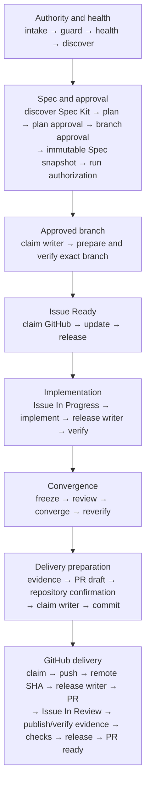

# Harness, graph, and loop architecture

## One ledger, three graph views

Each run persists its own append-only typed ledger. Derive these views instead
of running three databases in the first version:

- execution: `requires`, `blocks`, `fans_out`, `attempt_of`, `supersedes`;
- evidence: `produced_by`, `validates`, `invalidates`;
- knowledge: `derived_from`, `authoritative_for`, `superseded_by`.

The execution graph is acyclic. A repair creates a new attempt node linked with
`attempt_of` and `supersedes`, preserving the failed evidence.

Human corrections are append-only `feedback` records linked with `feedback_on`.
They invalidate affected plans, reviews, or evidence and may create a new
attempt; they never rewrite the earlier record. Durable improvement candidates
use `promoted_to` and remain separate reviewed changes.

This project layer does not replace an agent runtime. In Codex-primary mode,
reuse Codex's existing session/context, tool, sandbox, approval, and progress
surfaces; in Claude-primary mode, reuse Claude's corresponding runtime. The
provider-neutral contracts add project authority, graph state, cross-model
handoff, and evidence rather than implementing another shell or approval engine.

The local enforcement threat model is cooperative same-user concurrency, not a
hostile process boundary. A same-user process with direct filesystem and remote
credentials can bypass local JSON, hashes, locks, and dispatch records. For
adversarial isolation, signed authorization and a separate credential-holding
one-shot broker are required. This collection does not claim cryptographic
authority or remote exactly-once semantics without that external boundary.

Node states are `pending`, `ready`, `leased`, `acting`, `verifying`, `passed`,
`failed_retryable`, `failed_terminal`, `awaiting_approval`, `blocked`, `skipped`,
or `superseded`. Do not use an unqualified `done` state.

## Default task graph

The exact 41-node control spine is:

`intake → guard → health → discover → discover_spec_kit → plan → approve_plan
→ branch_approval → bind_spec_kit_snapshot → bind_run_authorization →
claim_implementation_writer → prepare_and_verify_branch →
claim_github_tracking → ensure_issue_ready → release_github_tracking →
claim_github_in_progress → mark_issue_in_progress →
release_github_in_progress → implement → release_implementation_writer →
verify → freeze_review → review → converge → reverify → prepare_evidence →
    prepare_pr → repository_confirmation → claim_delivery_writer → commit →
    claim_github_mutation → push → verify_remote_sha → release_delivery_writer →
    create_pr → mark_issue_in_review → publish_evidence →
verify_published_evidence → checks → release_github_mutation → pr_ready`.

`converge` is a decision node, not a hidden edit step. An accepted finding
creates a new implementation attempt and supersedes the old downstream nodes.
`reverify` therefore runs only after the current patch has converged and rejects
stale build, test, review, or evidence hashes.

Read-only research may fan out over a frozen snapshot. Repository writes,
Xcode project mutation, builds sharing a tuple, a Simulator/device, signing,
the host CoreSimulator runtime registry, release, and external writes require
scoped serialization.

## Scoped leases

At minimum distinguish:

- source checkout writer;
- Xcode project mutation;
- build tuple: Xcode/SDK/scheme/configuration/architecture/cache path;
- Simulator or device UDID;
- host CoreSimulator runtime registry;
- host macOS foreground GUI session;
- signing/App Store Connect mutation;
- GitHub external mutation.

For concurrent Xcode projects, a scope name alone is insufficient. One
normalized repository fingerprint owns one source-writer identity across every
checkout; the canonical root is excluded only from the writer identity and
remains the exact authorized execution target. Build records include repository/container/toolchain/scheme/
configuration/architecture/package plus explicit DerivedData, SourcePackages,
repository-checkout, artifact, and package-cache roles and their canonical path set. Two build
leases conflict whenever canonical mutable cache path trees are equal or one
contains the other, even if the other tuple fields differ. Resolve filesystem
aliases before comparison. Device identity is the coordinator instance plus a sorted, unique,
non-empty UDID set; leases conflict on the same host whenever those sets
intersect. A watch/phone pair therefore conflicts with a lease for either
member. Platform, bundle ID, and run ID are evidence metadata, not device
identity. Never lease a mutable destination by display name or `booted`. The
CoreSimulator registry key uses the host and shared registry scope, not Xcode
build, and conflicts with every active Simulator/device lease on that host.
An Xcode-project mutation conflicts with the source writer for the same logical
repository; the same canonical project/workspace container also conflicts even
if a caller supplies a different repository fingerprint.
Source, Xcode-project, and build leases for one repository conflict across
different owners. The same run/actor may nest its source lease around one Xcode
mutation or build lease. Project mutation and build remain disjoint except for
the exact same-run `xcode_project_packages` resolution sequence, which acquires
source → project → build and releases in reverse. A macOS
native UI test leases the coordinator instance's single `foreground_ui`
session; bundle/process identity remains evidence and does not create another
foreground session.

Record the normalized resource descriptor plus `lease_id`, owner, resource,
branch/base SHA, allowed paths/actions, coordinator instance/receipt, monotonic
fencing token, acquired/heartbeat/expires timestamps, and pre-write state hash.
Each heartbeat must replace the prior exact receipt and extend, never shorten,
its expiry.
Each run authority also binds one `run_ledger` canonical path, device/inode
identity, and initial approval digest. Reservation and dispatch use only the
locked descriptor, compare pathname identity before and after fsync, and reject
copied, hard-linked, renamed, or replaced ledgers.
Verify the private-harness path/instance/script binding and the same live,
unexpired coordinator receipt immediately before reserving a protected write,
then reverify the unconsumed reservation immediately adjacent to dispatch.
Apple dispatch executes the private digest-pinned guarded ASC probe again,
requires its observation timestamp to follow reservation, and compares stable
account/app/build/group state without treating the timestamp itself as state.
Remote systems do not enforce the local fence. A reserved grant stays consumed
after a crash; exact live readback and a fresh authorization replace blind retry.
The 60-second dispatch deadline bounds invocation start, not completion. An
authorized long-running wait completes within its action-specific async budget,
authorization window, and renewed lease. A crash between coordinator-state
persistence and ledger append burns the old run; exact coordinator/remote
readback and a fresh authorization replace fabricated reconciliation.
Expiry never permits silent takeover. Recovery requires the previous
receipt/fence plus a different observer run's fresh proof that the owner and its
child/tool processes are dead, the protected state is clean, and the live resource was revalidated; the
coordinator records recovery and advances the fence before replacement. Recheck
the tree/project hash immediately before writing because a human Xcode edit is
not controlled by the lease.

Recovery evidence is a fail-closed audit contract, not remote attestation. The
coordinator checks exact fields, timestamps, digests, and fences but cannot prove
that caller-observed host facts are truthful; retain the underlying read-only
diagnostic artifacts.

A normal release records the coordinator's persisted release confirmation. An
expired release records the persisted recovery confirmation instead. Offline
schema validation checks only structure; before any terminal state or later
protected action, validate every terminal confirmation against the configured
live coordinator state. A caller-authored `released_at` is never ownership
proof.

Derive `resource_key` deterministically from the ordered fields in
`capabilities.json` and record the clear field values in the lease evidence; do
not accept a model-invented opaque key that could alias another active resource.

Every acquire must have an explicit release record, and every terminal path
must observe those releases. The installed 41-node control spine is immutable;
a task cannot add control nodes. Instead, the approved run authorization lists
each task-specific `resource_plan` entry with an exact resource, canonical key,
descriptor digest, owner, and non-empty `protects` list of installed work nodes.
The ledger binds one exact coordinator receipt to that plan before any protected
node passes and records its release only after every protected node passed.
Missing, drifted, duplicated, premature, or unreleased planned leases fail both
offline lifecycle validation and action authorization.

The private project registry discovers candidates; each append-only ledger
records one run. Neither is a cross-run lock. Real serialization across separate
Codex/Claude processes or ledgers uses the configured host-shared state file and
`apple-verify resources`, which holds one file lock while it compares,
records, flushes, and issues a fenced receipt. Every mutating acquisition uses
it because independent runs cannot reliably know whether another run is active.
If the state path or live receipt is unavailable, enter `blocked` with reason
`coordination_required`. Never create a daemon, database, coordinator path, or
worktree as an implicit workaround.

The private harness binds the canonical state path, coordinator instance, and
SHA-256 of the exact installed coordinator script. Both clients use that one
binding. A script update blocks until active leases are closed or recovered,
the update is reviewed, the private binding is refreshed, and health passes;
automatic rehashing or a second state is forbidden. See
[coordinator setup](coordinator-setup.md).

Repository writer identity is versioned as `github_remote_v2`. Before first use
of a new coordinator state, explicitly quiesce and close all legacy or
unversioned leases, then bootstrap the state with that confirmation. Automatic
migration is forbidden; an unbootstrapped state returns `migration_required`.

## Patch and evidence identity

Use `patch_identity_v1`: SHA-256 over a version tag, base SHA, and records for
the complete intended path set sorted by UTF-8 bytes. Each record contains the
repository-relative path, Git mode, added/modified/deleted/symlink state, and
SHA-256 of the exact bytes or a deletion marker. Reject unlisted changed paths.
The immutable review bundle includes this identity plus the human-readable
binary/full-index diff.

Build, test, screenshot, and review evidence bind to that patch identity. After
commit, recompute records from the commit tree and require both its changed-path
set and records to match the reviewed identity. An empty post-commit working-tree
diff is therefore not mistaken for a different reviewed patch; any content,
mode, symlink, deletion, or path change invalidates affected evidence.

## Bounded attempts

- transient tool/network failure: one retry, two attempts total;
- compiler or test assertion: no blind retry; diagnose, change input/code, then
  create a new attempt;
- identical normalized failure hash twice: stop and escalate;
- implementation/convergence attempts: maximum three;
- independent review cycles: maximum two;
- default active-execution budget: 45 minutes unless the user sets another
  budget; time awaiting explicit human input or remote CI is recorded but does
  not consume this active budget;
- authority, account, project-root, branch, signing, permission, or destructive
  action failure: no retry; wait for a human gate.

## Completion predicate

All conditions are required:

1. every required node passed in dependency order;
2. the selected delivery-profile health report is fresh, target-bound, and
   satisfied;
3. the immutable run authorization is still current;
4. the accepted Spec Kit snapshot is current, or Spec Kit is explicitly not
   applicable;
5. the latest build/test/runtime evidence matches the current patch identity;
6. no resource lease remains active;
7. the immutable review identity still matches the delivered commit;
8. every acceptance criterion has current evidence or a recorded residual risk;
9. required screenshot, video, or artifact evidence is published and viewable;
10. the pull request exists;
11. its remote SHA matches the intended local commit;
12. required checks reached their required state; and
13. Issue/Project tracking is reconciled, or a non-rollback partial failure is
    explicitly recorded.

Loop exhaustion, partial platform success, or an uploaded artifact is not a
completion predicate.

## Engineering tradeoff gate

Planning must consider latency, availability, consistency, reliability,
maintainability, simplicity, and cost. Record only affected axes and one-line
rationale. Also record material data-lifecycle, security, accessibility, and
production-observability impact. This keeps human product context in the outer
loop without forcing a design essay for every small change.

Reference: Andrew Ng, [AI Engineering Skills Map: Software engineering
fundamentals](https://x.com/andrewyng/status/2093388974194872781).

Runtime integration reference: OpenAI,
[Codex as a platform](https://developers.openai.com/blog/codex-as-a-platform).
